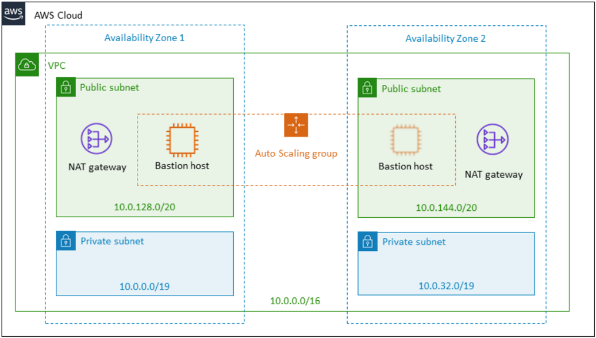

Deploying this Quick Start for a new https://aws.amazon.com/quickstart/architecture/{partner-company-name}-standard-infrastructure/[{vpc-name} (ASI)] with default parameters builds the following {partner-product-name-short} environment in the AWS Cloud.

// Replace this example diagram with your own. Send us your source PowerPoint file. Be sure to follow our guidelines here : http://(we should include these points on our contributors giude)
[#architecture1]
.Quick Start architecture for {partner-product-name-short} on AWS

As shown in figure 1, the Quick Start sets up the following:

* A highly available architecture that spans two Availability Zones.
* In the public subnets:
** A network address translation (NAT) gateway to allow outbound internet access for resources in the private subnets.
** A bastion host that enables secure access to {partner-product-name-short} without exposing it to the internet. For more information, see https://docs.aws.amazon.com/quickstart/latest/linux-bastion/architecture.html#bastion-hosts[Bastion Hosts]). You can choose not to provision a bastion host if you prefer to access {partner-product-name-short} nodes through the https://docs.aws.amazon.com/systems-manager/latest/userguide/session-manager.html[AWS Systems Manager].

After the Quick Start sets up this foundational stack, it https://docs.aws.amazon.com/AWSCloudFormation/latest/UserGuide/using-cfn-stack-exports.html[exports the stack’s output values] to expose these components to other stacks. The Quick Starts for https://fwd.aws/Wz3Qb[Jira], https://fwd.aws/kBpWN[Confluence], https://fwd.aws/dEX6W[Bitbucket] and https://fwd.aws/g6Q3D[Crowd] use the exported values to discover these underlying components, so you can easily provision Atlassian products on this infrastructure. For example, Figure 2 shows the Quick Start architecture for Jira, which is built on the ASI.

[#architecture2]
.Quick Start architecture for Jira on AWS
image::../images/jira-architecture.png[Architecture,width=640]